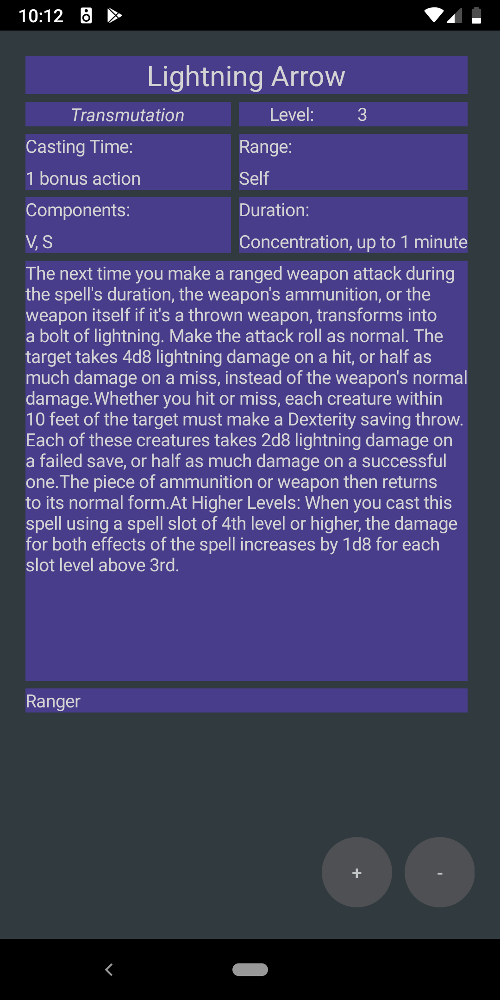
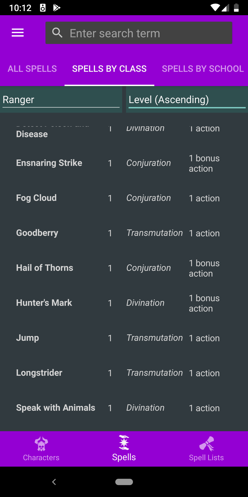

## Spell_Organizer_5E

Thank you for visting this repo. Hosted within is the early stage of a Spell Organizer app I'm making for mobile platforms. It lets you search a database of spells, add them to a spell list, and view the list as a series of swipable cards. The goal is to let users experience the closest thing to a hand of physical cards while enjoying the benefits of a digital medium such as sorting and persistent spell lists. Basic use cases are present but, overall, I rate the app as 25% complete. It has not been published yet being so earyl in development.

### Implemented Features

1. Navigation - The app has a flyout side bar that can be used to instantly navigate between each view page in the app. It also has a tab bar at the bottom of the screen for navigating between sections and a bar at the bottom for navigating sub-sections.
2. Spell Browsing - Users can browse a database of spells and view spell cards for each. The spell section has three subsections: All Spells, Spells by Class, and Spells by School. Each of the pages has filters and sorting options. 
3. A Basic Spell List - A spell list is created by default and flagged as the active spell list meaning users can start adding spells to it right away. The spell list can be opened and browsed by swiping through the spell cards. 
4. Persistence - The app maintains its spell list across sessions and remembers what spells are included. The user is alerted if they try to remove a spell from their list that is not included or add one that already is.

### To Do

1. Design - Basic colors and shapes have been selected now to make the app presentable but the app lacks a binding theme or flair.
2. Multiple Spell Lists - The app does not currently support creating new spell lists or naming them. This is the next planned feature.
3. Characters - They will be added as a way of semi-automatically generating spell lists. Users will select classes, subclasses, and race in additioning to pick a character level. The app will autocalculate spell slots, spells known, how many can be prepared (if applicable), and ask the user to choose spells to add to their characters. Users will still be able to put their character or list unmanaged mode where they control every detail.
4. Dice Roller - I would like to include a physics based dice roller that use a shake of the phone as a starting point. Users will be resonsible for their own luck. 
5. iOS support - The app is currently built only for Android.

### Screenshots

  

